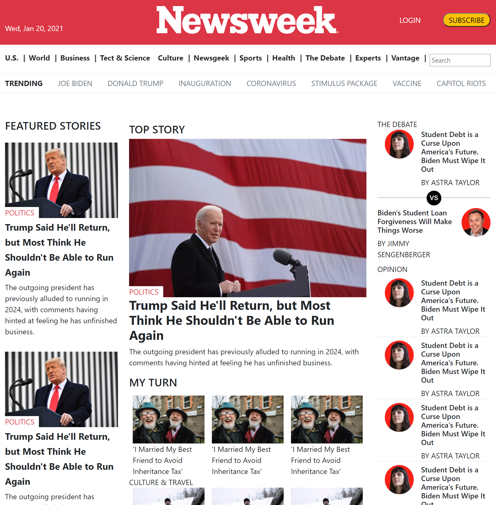

# Newsweek-Clone

> This is the 3rd collaborative Microverse project.

Additional description about the project and its features.

## Built With

- HTML & CSS
- Bootstrap

## Live Demo

[Live Demo Link]( https://arikarim.github.io/NewsWeek-clone-Page/)

## Authors

👤 **Author1**

- GitHub: [@RyelBanfield](https://github.com/RyelBanfield)
- Twitter: [@RyelBanfield](https://twitter.com/RyelBanfield)
- LinkedIn: [RyelBanfield](https://www.linkedin.com/in/ryel-banfield-93a6a71b4/)

👤 **Author2**

- GitHub: [@arikarim](https://github.com/arikarim)
- LinkedIn: [AriKarim](https://www.linkedin.com/in/ari-karim-523bb81b3)

## Show your support

Give a ⭐️ if you like this project!

## 📝 License

This project is [MIT](LICENSE) licensed.
